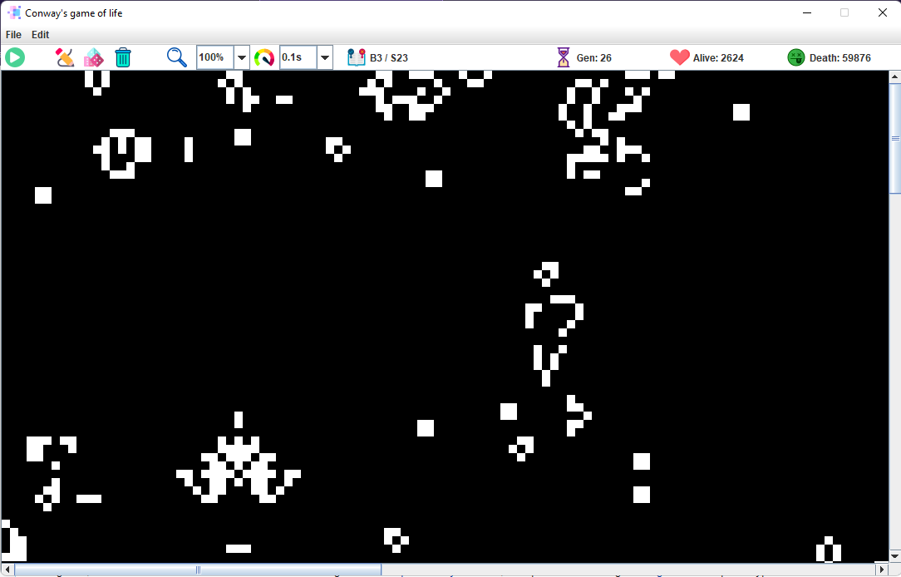

# TheGameOfLife

## Cellular automata

A cellular automaton (pl. cellular automata, abbrev. CA) is a discrete model of computation studied in automata theory. Cellular automata are also called cellular spaces, tessellation automata, homogeneous structures, cellular structures, tessellation structures, and iterative arrays. Cellular automata have found application in various areas, including physics, theoretical biology and microstructure modeling. ([Wikipedia](https://en.wikipedia.org/wiki/Cellular_automaton))

## Conway's game of life

The Game of Life, also known simply as Life, is a cellular automaton devised by the British mathematician John Horton Conway in 1970. It is a zero-player game, meaning that its evolution is determined by its initial state, requiring no further input. One interacts with the Game of Life by creating an initial configuration and observing how it evolves. It is Turing complete and can simulate a universal constructor or any other Turing machine. ([Wikipedia](https://en.wikipedia.org/wiki/Conway%27s_Game_of_Life))

### Rules

1. Any live cell with two or three live neighbours survives.
2. Any dead cell with three live neighbours becomes a live cell.
3. All other live cells die in the next generation. Similarly, all other dead cells stay dead.

# About this project

This is a Java GUI built with Maven that runs Game of life like cellular automatons . The app shows a panel that displays the CA with a specific configuration and the tools needed to manipulate it. The main features of this app are:

- CA cells color edition.
- CA world dimensions edition.
- Save CA as PNG image.
- Save and load CA configuration from a human readable text file.
- Mouse manipulations of CA cells (left click to set alive cells and right click to set death cells).
- CA rule edition in a Game of life format (B.../S...).
- CA world type: Toroidal and Finite (Out of the borders cells can be set as alive or death).
- Generate random CAs with an specified alive cells probability.
- Zoom manipulation.
- Speed of CA iterations manipulation.

## App

At start up the app displays a random generated world with 10% of alive cells probability applying rule B3/S23. The world is 250 cells length ad 250 cells height of 10 pixells per cell. Options in tool bar can manipulate the current CA. Use and set other features in the menu bar (color, cell size, etc.).



## Installation

Requirements and instructions to set up the environment are provided below.

### Requirements

- Java JDK 15
- Apache Maven 3.6.3

### Cloning and installing project

> If you only want to use the app, go to the releases published in this repository and download the jar file.

Downdload the project as a zip file or on your terminal run:

```bash
git clone https://github.com/luis-ale-117/TheGameOfLife.git
```

To build the project in your terminal go to the downloaded project directory and execute:
```bash
mvn clean install
```

To run the app just double click to the jar file in the `target` directory of the project or use the command below in your terminal:

```bash
java -jar TheGameOfLife-1.0-SNAPSHOT.jar
```

## Contributions

Any `Pull request` that allows the improvement of this project is welcome.

## License

See the [LICENSE](/LICENSE) file for license rights and limitations.
